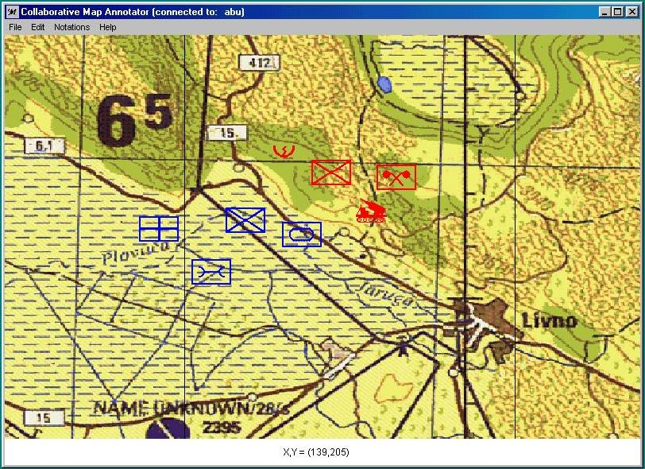

#Collaborative Map Annotator - Saved Repository

When I was an officer in the U.S. Air Force in the 1990's, I built post-mission analysis systems for the AWACS aircraft and later became a Human Computer Interaction R&D Scientist at the Air Force Research Laboratory in Rome, NY.  While at AFRL, we explored a wide range of HCI technologies and how they could support the Air Force's mission.  

When Java was first released, it became popular to use Java Applets to automate web pages.  By the time Java 1.1 emerged, it was apparent that Java's "write once, run anywhere" paradigm and simplified networking capabilities could be used to create larger mission-critical applications.  I researched how to use Java to enable a variety of computing platforms (e.g, Windows, Macintosh, Solaris, Unix, Irix, etc.) to collaboratively interact across networks.  This also helped augment our virtual reality research that spanned a range of computing platforms.

For one of my cross-platform research explorations, I created what I called the Collaborative Map Annotator (CMA).  The technical research focus was to enable interaction across a diverse set of computing systems.  In order to assist military commanders in seeing a practical application of these types of computing advancements, I added a military application focus.  For this demonstration scenario, military planners located in geographically separate locations and using a variety of computing platforms could interact in real-time to collaboratively plan battle scenarios.  In this demonstration, planners can add, delete, and move graphical icons representing a variety of force assets.  

Since this was a demonstration of potential computing and military capabilities and not an actual military asset, it was determined that it could be released to the public.  The last update I made to the CMA was in July 1997 and it was released via Rome Laboratory website.  Below is a representation of the web page I created in 1997 to describe the CMA -- the text and images were retrieved from the [Internet Archive](https://web.archive.org/web/19990208233237/http://www.if.afrl.af.mil/programs/ADII/adii_cma.html). 

Finding this page was very nostalgic for me, so I wanted to re-release it here.  To run the code, you will either need to install the JDK/JRE 1.1 from ~1997 or you will need to update the code.  I don't plan on making any updates to the CMA, as I only wanted to post it for historical purposes.  For details on how CMA was built and run in 1997, please see the original [readme](readme) file.

Enjoy!
 
 

 
# 
*Collaborative Map Annotator (CMA)*

As part of the ADII program, the ADII Team creates applications to demonstrate the capabilities of display or Human Computer Interaction (HCI) technology. From time-to-time, these demonstration programs may be publicly released when it is determined that they have no sensitive information and are of value to the general public.

The Collaborative Map Annotator (CMA) was created to show that users of the Interactive DataWall could work collaboratively with users of other computer systems whose displays and computer hardware may be different. The Java programming language was chosen since it facilitates portable source code, rapid prototyping, easy image handling, and language constructs that provide for collaboration. This code is made public in hopes that it may be useful to those learning and working with Java. The code may be freely used provided the author and the US Government are credited with having created this work.

The CMA demonstrates the following features:

* Creating a Java application (versus an applet)
* Remote Method Invocation (RMI)
* Entering / Leaving a collaborative session
* Image loading
* Image filtering
* Drawing lines (rubber-banding)
* Moving objects with the mouse
* Sockets for communication with other applications
* Persistent objects
* Menus
* Using packages

Using CMA

* Compile CMA using mkall.bat
* Start the RMIEngine (server) java RMIEngine.ServerInterfaceImpl
* Start the CMA (client) java CMA (host name where the RMIEngine is running)
* Start the optional voice interface
* Select File | Load Map to change the visible map

Download CMA.tar.Z (488K)

